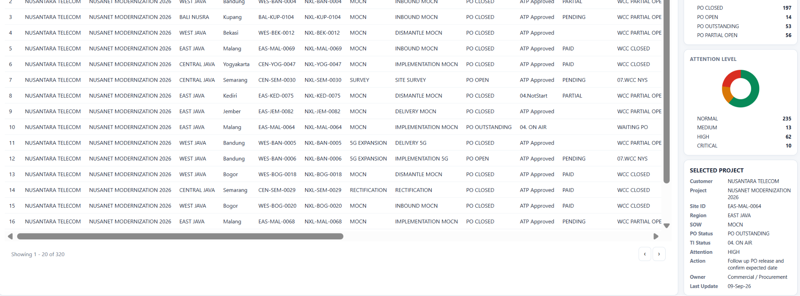
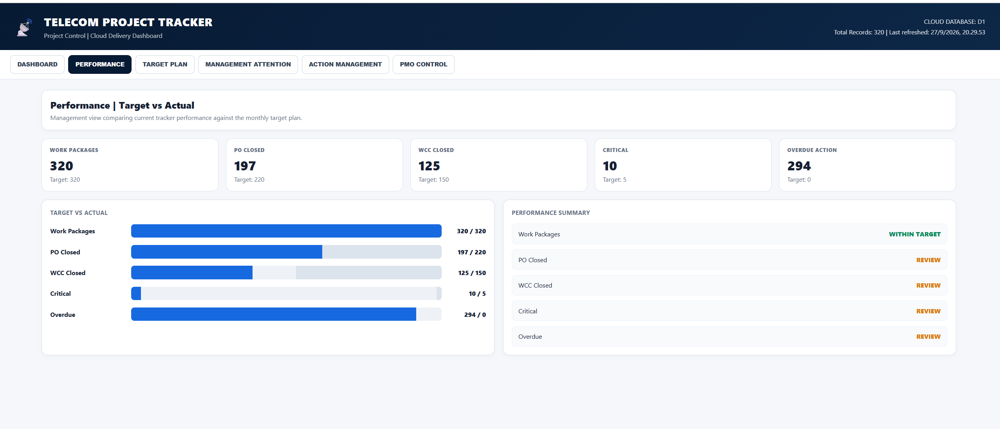
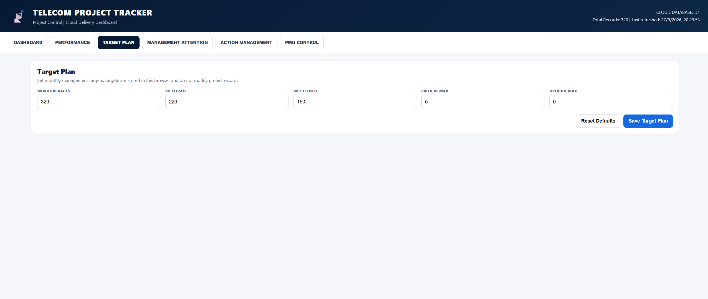
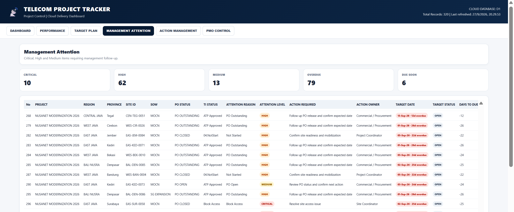
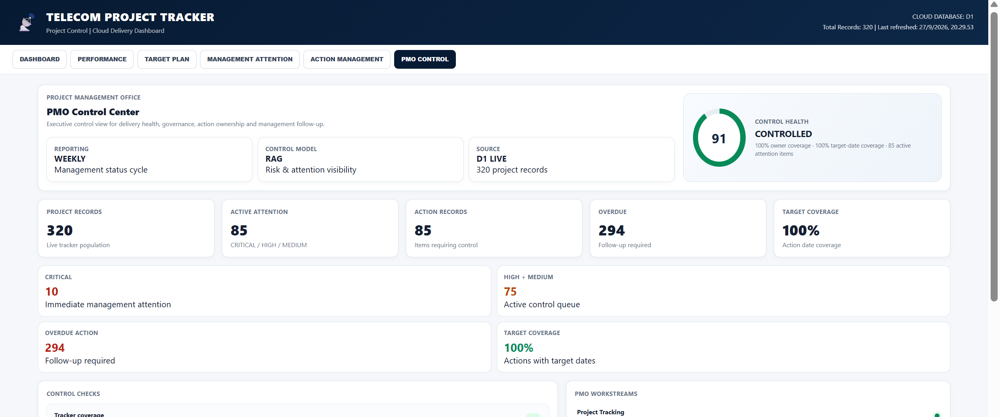

# Telecom Project Control & PMO Dashboard

A cloud-based project control and reporting system designed to monitor telecom project delivery, commercial status, technical readiness, management attention, action follow-up, and target vs actual performance.

## Live Demo

**Live Dashboard:**  
https://telecom-project-tracker.telkomproject-rifky.workers.dev/

**GitHub Repository:**  
https://github.com/rifkyraharja/Telecom-Project-Tracker

---

## Project Overview

This project demonstrates how telecom project tracking data can be transformed into a structured project control and PMO dashboard.

The system is designed around a telecom project environment where multiple work packages need to be monitored across project delivery, procurement, technical readiness, commercial status, action ownership, and management escalation.

The dashboard currently manages **320 project records** and provides management-oriented views for project control and reporting.

---

## Key Features

### Project Tracking

- Centralized project and work package tracking
- Customer, project, region, province, and site information
- Scope of work monitoring
- Technical and commercial status tracking

### KPI Dashboard

- Total project records
- PO status overview
- Attention-level monitoring
- Critical and high-priority project visibility
- Overdue action monitoring

### Commercial & PO Control

- PO Closed
- PO Open
- PO Outstanding
- PO Partial Open
- Commercial follow-up tracking

### Technical & Site Monitoring

- Technical status
- Site readiness
- Block Access monitoring
- WCC status
- Project delivery status

### Management Attention

The system automatically categorizes project records based on defined project-control rules:

- **CRITICAL** — immediate management attention
- **HIGH** — priority follow-up
- **MEDIUM** — monitoring and follow-up
- **NORMAL** — routine control

### Action Management

- Action required
- Action owner
- Target date
- Action due date
- Action status
- Days to due
- Follow-up flag
- Report flag
- Overdue monitoring

### Performance & Target Plan

- Actual vs target monitoring
- Work package target
- PO closed target
- WCC closed target
- Critical project threshold
- Overdue action threshold

### PMO Control Center

The PMO Control view provides an executive-level summary of:

- Control health
- Project records
- Active attention items
- Action records
- Overdue actions
- Target coverage
- Critical items
- High & medium attention
- Control checks
- PMO workstreams
- RAG status

---

## Dashboard Screenshots

### Main Dashboard



### Performance



### Target Plan



### Management Attention



### PMO Control Center



---

## Project Control Logic

The dashboard uses project-control rules to identify records requiring management attention.

### Attention Logic

```text
TI STATUS = Block Access
        ↓
    CRITICAL

TI STATUS = Not Start
OR
PO STATUS = Outstanding
        ↓
       HIGH

PO STATUS = Open
        ↓
      MEDIUM

Other conditions
        ↓
      NORMAL
